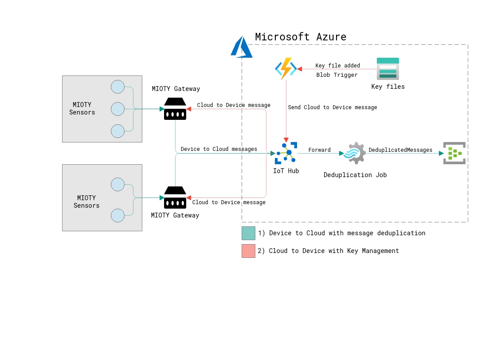

# MIOTY Azure Reference Architecture

This repository contains the sources and samples for the MIOTY and Azure reference architecture.

## Contents

- **azure-mioty-reference.png:** Chart showing the reference architecture
- **azuredeploy.json:** ARM Template to deploy the sample infrastructure to Azure
- **keyManagementFunction.zip:** Zipped source code of the Key Management Azure Function ready to be deplyoed
- **setup.ps1:** PowerShell Script that adds a sample device to the IoT Hub and deploys the keyManagementFunction.zip to the Azure Function
- **sample-mioty-keys.json** Sample file containing a new mioty key that can be used by the Azure Function to send this key to the Gateway
- **src:** Source code for all components
- **src/deduplication:** Source code for the Azure Stream Analytics Job doing the deduplication of the messages
- **src/key-management:** Source code for the Azure Function handling the key management
- **src/message-receiver:** Sample Event Hubs message receiver to retrieve the deduplicated messages

## Reference Architecture



## Deploy this solution to Azure

Follow this guide to setup the reference architecture on your Azure Subscription.

**Prerequisites**

- [x] MIOTY Device Id provided by your vendor
- [x] Azure Subscription with at least contributor rights

### 1) Deploy infrastructure to Azure

**a)** Use this button to open the Azure Portal and login with your credentials

[](https://portal.azure.com/#create/Microsoft.Template/uri/https%3A%2F%2Fraw.githubusercontent.com%2FTorbenWerner-MSFT%2Fmioty-sample%2Fdevelop%2Fazuredeploy.json)

**b)** The custom deployment blade will open. Select a subscription, resource group, region and a project name. The project name contains a default that will work if used as is. The project name will be used to create names for the different resources. Those that are unique in Azure will contain a unique string to make sure the name is valid

**c)** Click "Review+create", wait for the validation to pass and then click "Create"

**d)** Wait for the deployment to complete. Afterwards you will find the following resources inside your resource group:

* Azure IoT Hub
* Azure Stream Analytics Job for message deduplication
* Azure Event Hub Namespace and Event Hub as output for the Stream Analytics Job
* Azure Function and Consumption App Service Plan for the Key Management
* Azure Storage hosting the Azure Function and source for new MIOTY key files
* Azure Application Insights for the Azure Function

### 2) Download PowerShell Script and Azure Function code

To complete the setup of the reference architecture we need to add a device to the IoT Hub and deploy the Code of the Azure Function. You can do this on your own or use the provided PowerShell script. This guide only explains the usage of the PowerShell script.

**a)** Download the PowerShell script called *setup.ps1* and save it to the folder of your choice on your hard drive. You can use this direct link:
[setup.ps1](https://raw.githubusercontent.com/TorbenWerner-MSFT/mioty-sample/develop/setup.ps1)

**b)** Download the Azure Function source code called *keyManagementFunction.zip* and save it to the same folder you saved the script file in the step before. You can use this direct link:
[keyManagementFunction.zip](https://github.com/TorbenWerner-MSFT/mioty-sample/raw/develop/keyManagementFunction.zip)

### 3) Edit PowerShell Script

We need to set a few variables based on your deployment inside the PowerShell script file.

**a)** Open the file *setup.ps1* with the text editor of your choice. 

**b)** Replace the following section with the necessary values. They are located in line 2-5. You can find them inside the Azure Portal after running step 1. The device id will be provided together with your MIOTY Gateway device.

```
#$resourceGroupName = "[your-resource-group-name]"
#$iotHubName = "[your-iot-hub-name]"
#$deviceId = "[your-mioty-gateway-device-id]"
#$functionappname = "[your-key-management-function-name]"
```

Following a sample of this configuration.

```
$resourceGroupName = "mioty-azure"
$iotHubName = "mioty-sample-hub-dlaiovm7wqh2s"
$functionappname = "mioty-sample-func-dlaiovm7wqh2s"
$deviceId = "M000732412345"
```

**c)** Save the PowerShell script file

### 4) Run the PowerShell script

The script will add a device to the IoT Hub and deploys the code of the Azure Function.

**a)** Open a PowerShell command prompt and navigate to the folder containing the *setup.ps* file as well as the *keyMangementFunction.zip* file.

**b)** Type the following command to execute the setup script

```powershell
.\setup.ps1
```

**c)** The script will open a new browser tab asking you to login to Azure. Provide your credentials and login. The script uses this authentication to perform the operations on your behalf. The script will also ask if you want to deploy the Azure Function, confirm by typing *Y* when asked.

**d)** Wait for the script to complete. It will output the Device connection string as well as the IoT Hub connection string. Make note of it if you want to connect your device.

## Optional steps

After completing the steps above your reference architecture is fully deployed and ready to be used. If you would like to test follow these instructions.

### Testing your device

If you want to connect your Gateway to the IoT Hub please follow the instructions provided by your Gateway vendor. You will need to use the Device Connection String that was outputted by the script in step 4d).

### Testing the deduplication Job

After connecting your device and making sure it sends data to the Iot Hub you can try out the Azure Stream Analytics Job. 

**a)** Inside the Azure Portal navigate to your Azure Stream Analytics Job and start it from the Overview page. 

**b)** After the successfull start the Job will output the messages to the Event Hubs. Inside the src folder you find a sample message receiver written in .NET Core. Download it to your computer.

**c)** Inside src/message-receiver/EventHubMessageReceiver locate the file called *Program.cs* and open it with the text editor of your choice.

**d)** In line 12 and line 13 add the details for your Event Hubs connection string and the Event Hubs name. Save the file.

```csharp
private const string _connectionString = "[your-eventhubs-consumer-connection-string]";
private const string _eventHubName = "[your-eventhubs-name]";
```

**e)** Build and execvute the application like described in the .NET Core documentation

### Testing the Key Management Azure Function

After connecting your device to the IoT Hub and deploying the Azure Function code you can test the Key Management Azure Function. The function is connected to the provisoned Storage Account. You can download and use the sample key file provided inside this repository with the name *sample-mioty-keys.json*.

**a)** Download the sample file and replace the property *targetGatewayId* with the Id of your Gateway device. The Id is the one that we added to the PowerShell script and from the device that have been added to the IoT Hub.

**b)** Inside the Azure Portal navigate to the Storage Account created in step 1d)

**c)** On the Overview Blade click *Containers*. This will open the overview of available containers

**d)** Navigate to *mioty-keys* container

**e)** In the top menu click *Upload* and select the sample file from step a). Hit Upload.

**f)** Inside the Azure Portal navigate to your Azure Function

**g)** Select *Functions* / *KeyManagementBlobTriggerFunction* / *Monitor*

**h)** After a few minutes you should see the successfull run of the function. Click on the timestamp to see the log details 