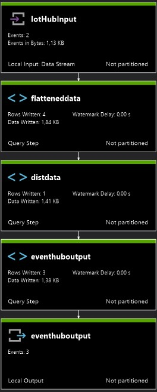

# MIOTY Azure Stream Analytics Job

This solution contains an Azure Stream Analytics Job that handles the message deduplication. Messages will flow from the IoT Hub into the Job, duplicates based on the *uuid* will be filtered and the cleaned message stream outputted to an Azure Event Hub.

## Job Diagram



## Job Steps

### Iot Hub Input

Input for the Stream Analytics Job. Sample input data.

```json
[{
  "header": {
    "gw": "M000732776771",
    "ts": "2020-12-08T12:49:43Z"
  },
  "data": [
    {
      "uid": "M70B3D567701110E1000",
      "rssi": -44.5,
      "snr": 22.6,
      "type": "MIOTY",
      "uuid": "6BBE709ABE2CFF939AB314752B8960C4",
      "ts": "2020-12-08T12:49:28Z",
      "frame": "4D494F5459"
    },
    {
      "uid": "M70B3D567701111D3000",
      "rssi": -80.1,
      "snr": 19.8,
      "type": "MIOTY",
      "uuid": "A336968B9D24F9C4E9815B69D3E8159D",
      "ts": "2020-12-08T12:49:29Z",
      "frame": "05640B6F2225BE"
    }
  ]
},{
  "header": {
    "gw": "M000732776771",
    "ts": "2020-12-08T12:50:00Z"
  },
  "data": [
    {
      "uid": "M70B3D567701110E1000",
      "rssi": -44.4,
      "snr": 22.7,
      "type": "MIOTY",
      "uuid": "09A9F8793D38406189E20079E06D3331",
      "ts": "2020-12-08T12:49:45Z",
      "frame": "4D494F5459"
    },
    {
      "uid": "M70B3D567701110E1000",
      "rssi": -44.4,
      "snr": 26.6,
      "type": "MIOTY",
      "uuid": "6BBE709ABE2CFF939AB314752B8960C4",
      "ts": "2020-12-08T12:49:48Z",
      "frame": "4D494F5459"
    }
  ]
}]
```

### 2) Flatteneddata

The provided input data contains a JSON Array with nested arrays containing the actual messages. This steps extracs the single messages and creates a flat structure out of it.

```json
{"headergw":"M000732776771","headerts":"2020-12-08T12:49:43Z","uid":"M70B3D567701110E1000","rssi":-44.5,"snr":22.6,"type":"MIOTY","uuid":"6BBE709ABE2CFF939AB314752B8960C4","ts":"2020-12-08T12:49:28Z","frame":"4D494F5459","EventProcessedUtcTime":null,"PartitionId":null,"EventEnqueuedUtcTime":null,"IotHubMessageId":null,"IotHubCorrelationId":null,"IotHubConnectionDeviceId":null,"IotHubConnectionDeviceGenerationId":null,"IotHubEnqueuedTime":null,"IotHubStreamId":null}
{"headergw":"M000732776771","headerts":"2020-12-08T12:49:43Z","uid":"M70B3D567701111D3000","rssi":-80.1,"snr":19.8,"type":"MIOTY","uuid":"A336968B9D24F9C4E9815B69D3E8159D","ts":"2020-12-08T12:49:29Z","frame":"05640B6F2225BE","EventProcessedUtcTime":null,"PartitionId":null,"EventEnqueuedUtcTime":null,"IotHubMessageId":null,"IotHubCorrelationId":null,"IotHubConnectionDeviceId":null,"IotHubConnectionDeviceGenerationId":null,"IotHubEnqueuedTime":null,"IotHubStreamId":null}
{"headergw":"M000732776771","headerts":"2020-12-08T12:50:00Z","uid":"M70B3D567701110E1000","rssi":-44.4,"snr":22.7,"type":"MIOTY","uuid":"09A9F8793D38406189E20079E06D3331","ts":"2020-12-08T12:49:45Z","frame":"4D494F5459","EventProcessedUtcTime":null,"PartitionId":null,"EventEnqueuedUtcTime":null,"IotHubMessageId":null,"IotHubCorrelationId":null,"IotHubConnectionDeviceId":null,"IotHubConnectionDeviceGenerationId":null,"IotHubEnqueuedTime":null,"IotHubStreamId":null}
{"headergw":"M000732776771","headerts":"2020-12-08T12:50:00Z","uid":"M70B3D567701110E1000","rssi":-44.4,"snr":26.6,"type":"MIOTY","uuid":"6BBE709ABE2CFF939AB314752B8960C4","ts":"2020-12-08T12:49:48Z","frame":"4D494F5459","EventProcessedUtcTime":null,"PartitionId":null,"EventEnqueuedUtcTime":null,"IotHubMessageId":null,"IotHubCorrelationId":null,"IotHubConnectionDeviceId":null,"IotHubConnectionDeviceGenerationId":null,"IotHubEnqueuedTime":null,"IotHubStreamId":null}
```

### 3) Distdata

This step uses a **User Defined Aggregate (UDA) Function** to detect and remove duplicates. The details of this function can be found inside the solution under [AsaDeduplicationJob/Functions/RemoveDups.js](AsaDeduplicationJob/Functions/RemoveDups.js). The sample output looks like this:

```json
{
	"RemoveDups": {
		"data": [
			{
				"headergw": "M000732776771",
				"headerts": "2020-12-08T12:49:43Z",
				"uid": "M70B3D567701110E1000",
				"rssi": -44.5,
				"snr": 22.6,
				"type": "MIOTY",
				"uuid": "6BBE709ABE2CFF939AB314752B8960C4",
				"ts": "2020-12-08T12:49:28Z",
				"frame": "4D494F5459",
				"EventProcessedUtcTime": null,
				"PartitionId": null,
				"EventEnqueuedUtcTime": null,
				"IotHubMessageId": null,
				"IotHubCorrelationId": null,
				"IotHubConnectionDeviceId": null,
				"IotHubConnectionDeviceGenerationId": null,
				"IotHubEnqueuedTime": null,
				"IotHubStreamId": null
			},
			{
				"headergw": "M000732776771",
				"headerts": "2020-12-08T12:49:43Z",
				"uid": "M70B3D567701111D3000",
				"rssi": -80.1,
				"snr": 19.8,
				"type": "MIOTY",
				"uuid": "A336968B9D24F9C4E9815B69D3E8159D",
				"ts": "2020-12-08T12:49:29Z",
				"frame": "05640B6F2225BE",
				"EventProcessedUtcTime": null,
				"PartitionId": null,
				"EventEnqueuedUtcTime": null,
				"IotHubMessageId": null,
				"IotHubCorrelationId": null,
				"IotHubConnectionDeviceId": null,
				"IotHubConnectionDeviceGenerationId": null,
				"IotHubEnqueuedTime": null,
				"IotHubStreamId": null
			},
			{
				"headergw": "M000732776771",
				"headerts": "2020-12-08T12:50:00Z",
				"uid": "M70B3D567701110E1000",
				"rssi": -44.4,
				"snr": 22.7,
				"type": "MIOTY",
				"uuid": "09A9F8793D38406189E20079E06D3331",
				"ts": "2020-12-08T12:49:45Z",
				"frame": "4D494F5459",
				"EventProcessedUtcTime": null,
				"PartitionId": null,
				"EventEnqueuedUtcTime": null,
				"IotHubMessageId": null,
				"IotHubCorrelationId": null,
				"IotHubConnectionDeviceId": null,
				"IotHubConnectionDeviceGenerationId": null,
				"IotHubEnqueuedTime": null,
				"IotHubStreamId": null
			}
		]
	}
}
```

### 4) EventHubOutput

The last step in the Job again flattens the data like in the first step to get each message in a single JSON object. Those will then be send to the Event Hub Output.

```json
{"headergw":"M000732776771","headerts":"2020-12-08T12:49:43Z","uid":"M70B3D567701110E1000","rssi":-44.5,"snr":22.6,"type":"MIOTY","uuid":"6BBE709ABE2CFF939AB314752B8960C4","ts":"2020-12-08T12:49:28Z","frame":"4D494F5459","EventProcessedUtcTime":null,"PartitionId":null,"EventEnqueuedUtcTime":null,"IotHubMessageId":null,"IotHubCorrelationId":null,"IotHubConnectionDeviceId":null,"IotHubConnectionDeviceGenerationId":null,"IotHubEnqueuedTime":null,"IotHubStreamId":null}
{"headergw":"M000732776771","headerts":"2020-12-08T12:49:43Z","uid":"M70B3D567701111D3000","rssi":-80.1,"snr":19.8,"type":"MIOTY","uuid":"A336968B9D24F9C4E9815B69D3E8159D","ts":"2020-12-08T12:49:29Z","frame":"05640B6F2225BE","EventProcessedUtcTime":null,"PartitionId":null,"EventEnqueuedUtcTime":null,"IotHubMessageId":null,"IotHubCorrelationId":null,"IotHubConnectionDeviceId":null,"IotHubConnectionDeviceGenerationId":null,"IotHubEnqueuedTime":null,"IotHubStreamId":null}
{"headergw":"M000732776771","headerts":"2020-12-08T12:50:00Z","uid":"M70B3D567701110E1000","rssi":-44.4,"snr":22.7,"type":"MIOTY","uuid":"09A9F8793D38406189E20079E06D3331","ts":"2020-12-08T12:49:45Z","frame":"4D494F5459","EventProcessedUtcTime":null,"PartitionId":null,"EventEnqueuedUtcTime":null,"IotHubMessageId":null,"IotHubCorrelationId":null,"IotHubConnectionDeviceId":null,"IotHubConnectionDeviceGenerationId":null,"IotHubEnqueuedTime":null,"IotHubStreamId":null}


```